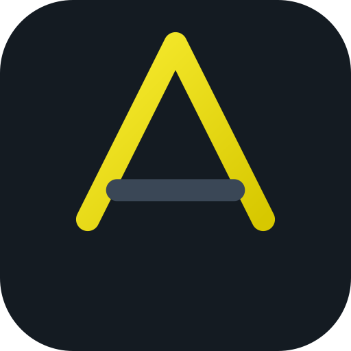

  

<h1 align="center">ArmoTuSitio.com Lab</h1>

  Plataforma educativa interactiva para aprender <strong>TypeScript</strong> y <strong>SASS</strong> sobre una aplicación frontend real.

  <a href="https://drako01.github.io/jugando_con_typescript/"><strong>🌐 Ver plataforma online</strong></a>
  ·
  <a href="./CONTRIBUTING.md">Contribuir</a>
  ·
  <a href="./CHANGELOG.md">Changelog</a>

  
  
  
  

---

## Sobre el proyecto

**ArmoTuSitio.com Lab** nació como un laboratorio para practicar TypeScript y evolucionó hacia una plataforma de aprendizaje frontend interactiva.

El proyecto combina:

- rutas progresivas de aprendizaje;
- teoría aplicada;
- checkpoints y desafíos;
- progreso persistente en el navegador;
- laboratorio CRUD real;
- búsqueda y bookmarks;
- proyectos finales;
- arquitectura TypeScript y SASS sin frameworks de UI.

La plataforma está pensada para aprender conceptos reales sin esconderlos detrás de demasiadas abstracciones.

> El contenido pedagógico completo vive en la plataforma publicada. Este README se mantiene deliberadamente enfocado en el proyecto, su arquitectura y cómo colaborar.

---

## Demo

**https://drako01.github.io/jugando_con_typescript/**

La publicación se realiza automáticamente desde <code>main</code> mediante GitHub Actions hacia la rama <code>gh-pages</code>.

---

## Qué incluye

### Learning Platform

- 12 módulos de TypeScript.
- 12 módulos de SASS / SCSS.
- 8 desafíos prácticos.
- niveles: Fundamentos, Intermedio, Avanzado y Profesional.
- progreso global y por ruta.
- continuar desde el último módulo visitado.
- bookmarks persistentes.
- búsqueda global y glosario.
- búsqueda dentro de cada curso.
- objetivos y tiempo estimado por lección.
- proyectos finales de TypeScript y SASS.
- desafío integrador.

### Laboratorio práctico

El laboratorio utiliza un dominio académico sencillo:

~~~text
Categoría
   ↓
Profesor
   ↓
Curso
   ↓
Alumno
~~~

Permite experimentar con:

- clases y contratos;
- DOM tipado;
- eventos y formularios;
- relaciones entre entidades;
- localStorage;
- serialización JSON;
- estados y validaciones;
- arquitectura modular;
- SASS responsive.

También incluye datos demo, inspector de storage, reset seguro, estados vacíos, feedback visual y operaciones CRUD.

---

## Stack

- **TypeScript 6**
- **SASS / SCSS**
- **HTML5**
- **DOM APIs**
- **localStorage**
- **GitHub Actions**
- **GitHub Pages**

No utiliza React, Vue, Angular ni frameworks de UI.

Esto es intencional: el objetivo del laboratorio es que la arquitectura, el DOM, el tipado y los estilos sean visibles y estudiables.

---

## Arquitectura

~~~text
.
├── assets/
│   ├── css/                  # CSS generado
│   ├── img/
│   └── js/                   # JavaScript generado
│
├── docs/                     # Material histórico / referencia
│
├── sass/
│   ├── base/
│   ├── components/
│   ├── layout/
│   └── styles.scss
│
├── type/
│   ├── functions/
│   ├── learning/
│   │   └── catalog.ts        # catálogo de cursos y metadata
│   ├── models/
│   ├── index.ts              # laboratorio
│   ├── platform.ts           # experiencia de plataforma
│   └── tutorial.ts           # interacción de las rutas
│
├── index.html
├── learn-typescript.html
├── learn-sass.html
├── practice.html
├── package.json
└── tsconfig.json
~~~

### Piezas principales

| Archivo | Responsabilidad |
| --- | --- |
| <code>type/learning/catalog.ts</code> | metadata de cursos, módulos, niveles, objetivos y búsqueda |
| <code>type/platform.ts</code> | dashboard, progreso, búsqueda, bookmarks y navegación |
| <code>type/tutorial.ts</code> | interacción de lecciones, checkpoints y progreso |
| <code>type/index.ts</code> | comportamiento del laboratorio práctico |
| <code>sass/components/_platform.scss</code> | UI específica de la plataforma |
| <code>sass/styles.scss</code> | entry point de estilos |
| <code>index.html</code> | dashboard y laboratorio |
| <code>practice.html</code> | desafíos prácticos |

---

## Desarrollo local

### Requisitos

- Node.js 22+ recomendado
- npm
- navegador moderno

### Instalación

~~~bash
git clone https://github.com/Drako01/jugando_con_typescript.git
cd jugando_con_typescript
npm ci
~~~

### Build completo

~~~bash
npm run build
~~~

Compila:

- TypeScript → <code>assets/js/</code>
- SASS → <code>assets/css/styles.css</code>

Después podés servir <code>index.html</code> con cualquier servidor estático local.

### Scripts

~~~bash
npm run typecheck
npm run build
npm run watch
npm run styles
npm run styles:watch
~~~

| Script | Uso |
| --- | --- |
| <code>npm run typecheck</code> | valida TypeScript sin emitir archivos |
| <code>npm run build</code> | compila TypeScript y SASS |
| <code>npm run watch</code> | observa cambios TypeScript |
| <code>npm run styles</code> | compila SASS |
| <code>npm run styles:watch</code> | observa cambios SASS |

---

## CI/CD

Los Pull Requests contra <code>main</code> ejecutan automáticamente:

~~~text
npm ci
npm run typecheck
npm run build
~~~

Los pushes a <code>main</code> también disparan el despliegue a GitHub Pages.

El pipeline valida que existan los assets compilados antes de publicar para evitar deployments incompletos.

---

## Contribuciones

Las contribuciones son bienvenidas.

Podés colaborar con:

- nuevos ejercicios;
- mejoras pedagógicas;
- correcciones conceptuales;
- mejoras TypeScript;
- mejoras de arquitectura SASS;
- accesibilidad;
- UX/UI;
- responsive;
- documentación técnica;
- bugs del laboratorio;
- nuevos desafíos o ejemplos.

Antes de comenzar, leé **[CONTRIBUTING.md](./CONTRIBUTING.md)**.

El flujo recomendado es:

~~~text
fork
  ↓
feature branch
  ↓
cambios + validaciones
  ↓
Pull Request → main
  ↓
CI
  ↓
review
~~~

---

## Changelog

La evolución del proyecto se documenta en **[CHANGELOG.md](./CHANGELOG.md)**.

---

## Licencia

Distribuido bajo licencia MIT.

Ver **[LICENCE](./LICENCE)**.

---

## Autor

**Alejandro Di Stefano**

- GitHub: [@Drako01](https://github.com/Drako01)
- Desarrollo: [ArmoTuSitio.com](https://armotusitio.com.ar/)

---

  Desarrollado como plataforma educativa y laboratorio práctico por <strong>ArmoTuSitio.com</strong>.

